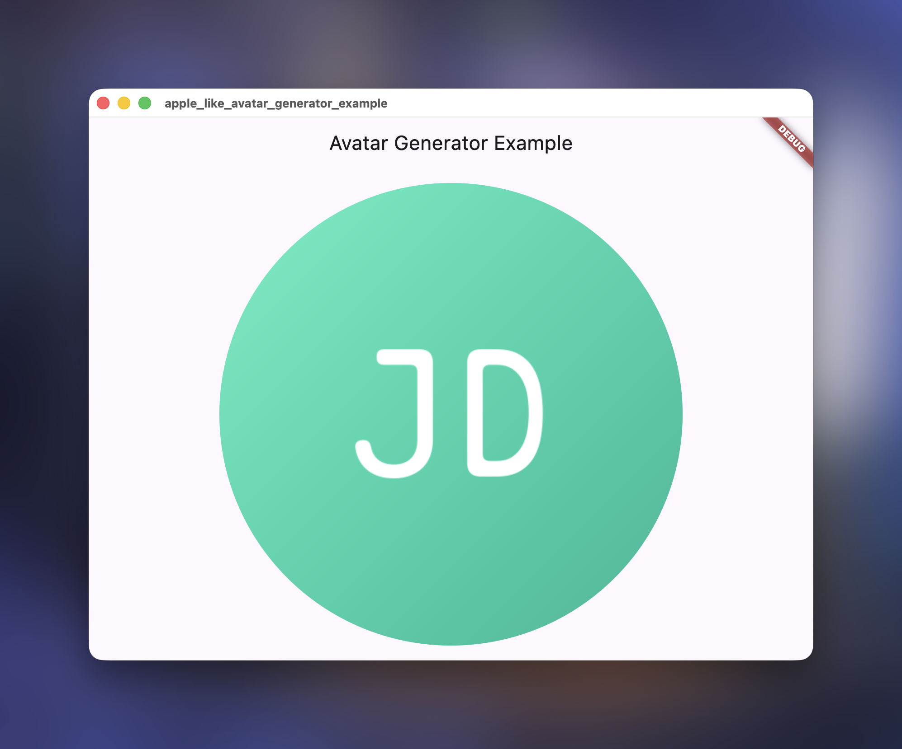

# apple_like_avatar_generator

A module can generate a text avatar like apple generated. Render engine powered by [takumi](https://github.com/kane50613/takumi).

## Screenshot



## Prerequisite
Because this avatar generator depend on takumi, please make sure you have rust compiler with version 1.85.1 or above installed.

## Usage
First, you need to initialize the module in main function:
```dart
Future<void> main() async {
  await AppleLikeAvatarGenerator.init();    //Add this line
  runApp(const MyApp());
}
```

Then you can use this module to generate Apple-like text avatar, and display it with `Image#memory`.

For example:

```dart
FutureBuilder<Uint8List>(
  future: AppleLikeAvatarGenerator.generateWithName("John Doe"),
  builder: (context, snapshot) {
    if (snapshot.connectionState == ConnectionState.waiting) {
      return const CircularProgressIndicator();
    } else if (snapshot.hasError) {
      return Text('Error: ${snapshot.error}');
    } else if (snapshot.hasData) {
      return Image.memory(snapshot.data!, width: 512, height: 512);
    } else {
      return const Text('No data');
    }
  },
)
```

> [!NOTE]
> Avatar generated by this module is **rectangular**, if you want to display it in circular, remember to use `ClipOval` widget to clip it!

You can see real Flutter usage example in example folder.

## Contribution
Welcome to contribute to this project. Feel free to open an issue or submit a pull request.
